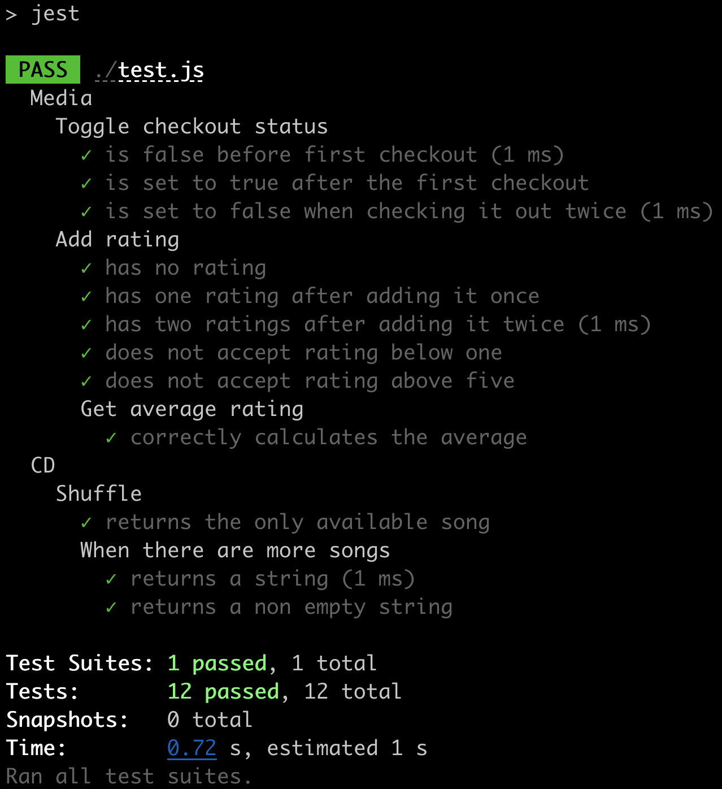

# library

Library project based on the introduction to JavaScript course from codecademy.

## Dev dependencies installation

Run `npm i` to install the dev dependencies.

## Running the tests

Run `npm t` to run the unit tests.

> After running the tests, you should see a result like the one below.

___

Made with ❤️ by [Walmyr Filho](https://walmyr-filho.com)
